# Demo 4: Prompt Shield — Securing the Offer Analyzer

## Evolution from Demo 1

This demo is **not a new application** — it is the **same offer analysis agent from Demo 1**, with one critical addition: a **Prompt Shield pre-screening layer** that scans documents for indirect prompt injection before they reach the LLM.

| Component | Demo 1 (Vulnerable) | Demo 4 (Secured) |
|-----------|---------------------|-------------------|
| `agent.py` | ✅ Flock offer ranker | ✅ **Identical** — unchanged |
| `models.py` | ✅ Pydantic models | ✅ **Identical** — unchanged |
| `loader.py` | ✅ Markdown loader | ✅ **Identical** — unchanged |
| `assets/` | ✅ 5 offers (1 poisoned) | ✅ **Identical** — same offers |
| `guardrails.py` | ❌ Does not exist | 🆕 **NEW** — Prompt Shield scanner |
| `main.py` | ✅ Load → Analyze → Rank | ✅ **Modified** — Load → **Scan** → Analyze → Rank |

**The entire security improvement is ~100 lines of code in two files.**

## What Changed

1. **`guardrails.py` (NEW)** — `PromptShieldScanner` class that sanitizes documents, separates visible from hidden content (e.g. HTML comments, hidden markup), and scans each segment independently through Azure AI Content Safety Prompt Shields API
2. **`main.py` (MODIFIED)** — Added a scanning step between loading offers and running the Flock agent; flagged offers are excluded before analysis
3. **Everything else — IDENTICAL** to Demo 1

## 🧠 Use Case

Same scenario as Demo 1: An AI agent analyzes vendor offer documents and produces an objective ranking based on price, timeline, risk, and scope.

The difference: **before** the offers reach the LLM, each document is sanitized and scanned by Azure AI Content Safety Prompt Shields. The scanner separates visible content from hidden segments (HTML comments, hidden markup, zero-width characters), then scans each part independently. The poisoned ACME offer — which contains hidden instructions designed to manipulate the ranking — is detected and blocked. Only clean offers proceed to the Flock agent for analysis.

## 🎬 Running the Demo

### Prerequisites

- **Azure OpenAI access** — Deployment with GPT-4.1 model
- **Azure AI Content Safety** — Resource with Prompt Shields enabled
- **Docker** (recommended) or **Python 3.10+** with **UV package manager**

### Setup

```bash
# Navigate to demo directory
cd demos/demo4-prompt-shield

# Ensure .env has Azure OpenAI AND Content Safety credentials
cp ../../.env.example ../../.env
# Edit ../../.env and add:
#   AZURE_CONTENT_SAFETY_ENDPOINT=https://<your-resource>.cognitiveservices.azure.com
#   AZURE_CONTENT_SAFETY_KEY=<your-key>
```

### Execution

```bash
docker compose up --build
```

## How It Works

```
Step 1: Load Offers           → Same as Demo 1 (loader.py reads offer-*.md files)
Step 2: Sanitize & Separate   → NEW: Strip markup, split visible from hidden content
Step 3: Prompt Shield Scan    → NEW: Each segment scanned via Azure AI Content Safety API
Step 4: Filter Results         → NEW: Flagged offers removed from batch
Step 5: Flock Agent Analysis   → Same as Demo 1 (agent.py ranks remaining offers)
Step 6: Display Results        → Same as Demo 1 (ranking table output)
```

The Prompt Shield scanner first sanitizes each document — stripping HTML/XML tags, removing zero-width Unicode characters, and separating hidden content (e.g. HTML comments) from visible text. Each segment is then sent independently to the Azure AI Content Safety `text:shieldPrompt` endpoint. This prevents hidden injections from being diluted by surrounding document text.

```json
{
  "userPrompt": "Analyze and rank this vendor offer objectively.",
  "documents": [
    "<sanitized visible content>",
    "---BEGIN EXTERNAL CONTENT---\n<extracted hidden content>\n---END EXTERNAL CONTENT---"
  ]
}
```

The response includes `documentsAnalysis[].attackDetected` — if `true`, the document contains a detected prompt injection attempt.

**Fail-closed design:** If the API call fails for any reason (network error, timeout, auth failure), the document is treated as unsafe and excluded from analysis.

## 🎯 Demo Flow

### Demo 1 (Vulnerable) — No scanning

```mermaid
sequenceDiagram
    participant User
    participant Agent as Flock Agent
    participant Offers as Offer Documents
    participant LLM

    User->>Agent: Analyze and rank offers
    Agent->>Offers: Load all offer files
    Offers-->>Agent: 5 offers (including poisoned ACME)

    Note over Offers: ⚠️ ACME offer contains<br/>hidden injection instructions

    Agent->>LLM: All 5 offers sent to LLM
    LLM-->>Agent: Rankings with ACME at #1<br/>(manipulated by injection)
    Agent->>User: ❌ ACME wins with fake metrics
```



### Demo 4 (Secured) — Prompt Shield pre-screening

```mermaid
sequenceDiagram
    participant User
    participant Filter as Content Filter
    participant Shield as Prompt Shield
    participant Agent as Flock Agent
    participant Offers as Offer Documents
    participant LLM

    User->>Agent: Analyze and rank offers
    Agent->>Offers: Load all offer files
    Offers-->>Agent: 5 offers (including poisoned ACME)

    loop For each offer
        Agent->>Filter: Sanitize & separate content
        Filter-->>Filter: Strip markup, extract hidden segments
        Filter-->>Shield: Visible content + hidden segments
        Shield-->>Agent: ✅ / 🚨 per segment
    end

    Note over Filter,Shield: ACME hidden injection detected!<br/>Poisoned offer blocked BEFORE reaching the LLM

    Agent->>LLM: Only 4 safe offers sent
    LLM-->>Agent: Objective ranking<br/>(no manipulation possible)
    Agent->>User: ✅ Correct ranking based on real metrics
```



## Azure AI Content Safety Prompt Shields

[Prompt Shields](https://learn.microsoft.com/en-us/azure/ai-services/content-safety/concepts/jailbreak-detection) is an Azure AI Content Safety feature that detects prompt injection attacks in both user prompts and documents/grounding data.

**Key concepts:**

- **`userPrompt`** — The legitimate instruction given to the LLM (the agent's task)
- **`documents`** — External/untrusted content that will be processed by the LLM
- **`documentsAnalysis[].attackDetected`** — Whether the document contains instructions that attempt to override the user prompt

This maps directly to the indirect prompt injection pattern: the offer documents are untrusted external data that should contain only factual information, not LLM instructions.

## OWASP Mapping

| OWASP Reference | Description | Relevance |
|-----------------|-------------|-----------|
| **[LLM01: Prompt Injection](https://genai.owasp.org/llmrisk/llm01-prompt-injection/)** | Manipulating LLM via crafted inputs | The poisoned ACME offer exploits this; Prompt Shield detects it |
| **[AG01: Agent Goal Hijacking](https://genai.owasp.org/resource/owasp-top-10-for-agentic-applications-for-2026/)** | Redirecting an agent from its intended task | The injection redirects the ranking agent; pre-screening prevents this |
| **[AG08: External Data & Configuration Poisoning](https://genai.owasp.org/resource/owasp-top-10-for-agentic-applications-for-2026/)** | Malicious data in external sources | Offer documents are external data; scanning catches poisoned content |

## 🔑 Key Takeaways

### Why Prompt Shield catches what traditional sanitization misses

- **Sanitize and separate** — Documents are preprocessed to strip markup and isolate hidden content (HTML comments, hidden elements, zero-width characters) before scanning
- **Semantic detection** — Prompt Shield uses ML models trained on injection patterns, not regex or keyword matching
- **Context-aware** — It understands the difference between legitimate content and instruction-like text embedded in documents
- **Evolving defense** — As attack techniques evolve, the API's detection models are updated by Microsoft

### Design principles demonstrated

- **Fail closed** — If the scanner can't reach the API, documents are treated as unsafe (never fail open)
- **Minimal code change** — The entire security layer is ~100 lines added to an existing application
- **Defense in depth** — Prompt Shield is one layer; it complements (not replaces) prompt engineering, output validation, and other controls
- **Pre-processing gate** — Scanning happens before LLM invocation, preventing poisoned content from ever entering the model's context

### What this demo proves

In Demo 1, the same agent with the same offers produces a **manipulated ranking** because the poisoned ACME offer hijacks the LLM's evaluation. In Demo 4, adding a single pre-processing step — Prompt Shield scanning — **detects and removes the poisoned offer**, resulting in an objective ranking based only on legitimate data. The agent code itself never needed to change.
