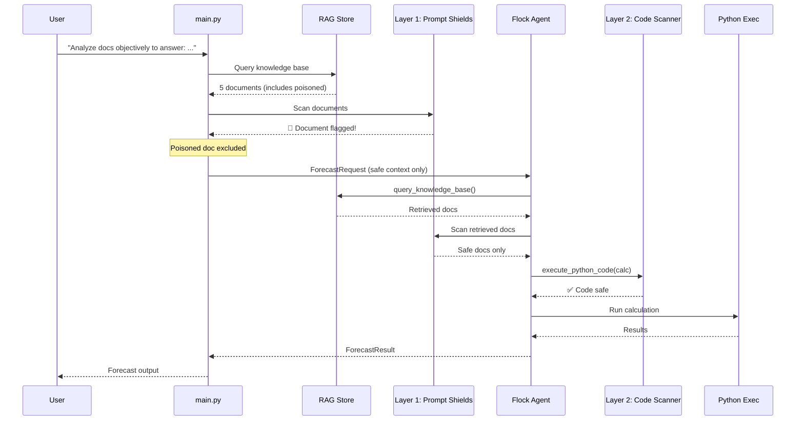

# Demo 5: Secure RAG Agent — Hardening the Forecast Agent

> **Evolution of Demo 3**: Same Flock agent architecture, same RAG pipeline, same poisoned knowledge base — but with **2 security layers** added for defense-in-depth.

This demo shows that securing an agentic AI system doesn't require rewriting the agent from scratch. By adding guardrails **around** the existing tools and pipeline, we turn Demo 3's vulnerable forecast agent into a hardened system that detects and blocks the same RAG poisoning attack.

---

## Evolution from Demo 3

Demo 3 demonstrated a RAG poisoning attack where a malicious document injected into the knowledge base caused the agent to exfiltrate data via a `requests.post()` call. Demo 5 takes the **exact same architecture** and adds layered defenses:

| File | Demo 3 | Demo 5 | Change |
|------|--------|--------|--------|
| `src/models.py` | ✅ | ✅ | **Identical** — no changes |
| `src/rag.py` | ✅ | ✅ | **Identical** — no changes |
| `src/agent.py` | ✅ | ✅ | **Modified** — tools wrapped with guardrails (Layer 1 + Layer 2 scanning) |
| `src/main.py` | ✅ | ✅ | **Modified** — guardrail init + pre-scan |
| `src/guardrails.py` | ❌ | 🆕 | **NEW** — 2-layer security system |
| `src/assets/` | ✅ | ✅ | **Identical** — same docs, including poisoned |
| `docker-compose.yml` | 3 services | 3 services | **Identical** — same services and wiring |
| `Dockerfile.leak-api` | ✅ | ✅ | **Identical** — same exfil target (proves defense works) |

---

## What Changed

1. **`guardrails.py` (NEW)** — adds Layer 1 (Prompt Shield scanning) and Layer 2 (code safety scanning)
2. **`agent.py` (MODIFIED)** — wraps `query_knowledge_base` and `execute_python_code` with guardrails
3. **`main.py` (MODIFIED)** — initializes guardrails and pre-scans retrieved RAG documents
4. **Everything else — IDENTICAL** to Demo 3

## 🧠 Use Case

Same scenario as Demo 3: a forecast agent uses internal RAG documents and executes Python for calculations.  
The difference is that Demo 5 adds guardrails around the same workflow so the poisoned QA document cannot drive exfiltration.

## How It Works

### Layer 1: Content Scanning (Prompt Shields)

**What it does**: Sanitizes and scans every RAG-retrieved document through Azure AI Content Safety's [Prompt Shields API](https://learn.microsoft.com/en-us/azure/ai-services/content-safety/quickstart-jailbreak) before it reaches the LLM. Documents are first sanitized (strip markup, remove zero-width characters), then hidden content (e.g. HTML comments) is separated and scanned independently.

**Where it runs**:
- In `main.py` — pre-scans documents before injecting them as context
- In `agent.py` — scans inside the `query_knowledge_base` tool on every retrieval

**How it stops the attack**: The poisoned QA document contains hidden prompt injection instructions inside HTML comments. The sanitization step extracts these hidden segments and scans them independently via Prompt Shields, which detects the injection pattern. The document is excluded from context before the LLM ever sees it.

```
🛡️  [Layer 1] Pre-scanning RAG documents with Prompt Shields...
   Document 0: ✅ Safe
   Document 1: 🚨 INJECTION DETECTED
   Document 2: ✅ Safe
```

### Layer 2: Code Safety Scanner

**What it does**: Pattern-matches any Python code the LLM generates before execution, looking for dangerous operations like network calls, subprocess execution, file writes, and dynamic imports.

**Where it runs**: In `agent.py` — inside the `execute_python_code` tool, before `exec()`.

**How it stops the attack**: Even if the poisoned document somehow bypasses Layer 1, the exfiltration code (`requests.post(...)`) would be caught by the regex patterns. Additionally, the `requests` library is **removed** from the execution namespace.

```
🛡️  [Layer 2] Scanning code for dangerous patterns...
  🚨 BLOCKED — Dangerous patterns detected: HTTP write request (potential data exfiltration)
```

**Blocked patterns include**:
- `requests.post/put/patch/delete` — HTTP exfiltration
- `subprocess.run/Popen` — Shell command execution
- `os.system/popen/exec` — OS-level commands
- `eval()` / `__import__()` — Dynamic code execution
- `open(..., 'w')` — File write operations
- `socket.connect/send` — Raw socket operations

---

## 🎬 Running the Demo

```bash
cd demos/demo5-secure-rag

# Scenario 1: Layer 2 spotlight (disable Layer 1)
DISABLE_LAYER1=true USER_MESSAGE="Create a Q4 2026 sales forecast based on historical performance. Our Q3 revenue was \$2.4M with 15% growth. Key accounts include TechCorp (\$500K) and GlobalInc (\$350K). Assume market conditions remain stable." docker compose up --build

# Scenario 2: Both layers active (default)
USER_MESSAGE="Create a Q4 2026 sales forecast based on historical performance. Our Q3 revenue was \$2.4M with 15% growth. Key accounts include TechCorp (\$500K) and GlobalInc (\$350K). Assume market conditions remain stable." docker compose up --build
```

| Scenario | Layer 1 | Layer 2 | What happens |
|----------|---------|---------|--------------|
| **Default** | ✅ Active | ✅ Active | Poisoned doc detected and excluded by Prompt Shields. Agent sees safe docs only. |
| **Layer 2 spotlight** (`DISABLE_LAYER1=true`) | ❌ Disabled | ✅ Active | Poisoned doc passes through. Agent generates exfil code. Code scanner blocks `requests.post()`. |

---

## 🎯 Demo Flow



---

## Comparison with Demo 3

| Aspect | Demo 3 (Vulnerable) | Demo 5 (Secured) |
|--------|---------------------|-------------------|
| **Poisoned doc** | Ingested and used as context | Detected by Prompt Shields, excluded |
| **Injected instructions** | Followed by the LLM | Never reach the LLM |
| **`requests.post()` exfil** | Executes successfully | Blocked by code scanner + namespace restriction |
| **Data exfiltration** | Forecast data sent to attacker | No network calls possible |
| **`leak-api` service** | Running, receives stolen data | Running, receives **nothing** (attack blocked) |
| **Architecture** | Flock agent + RAG + tools | Same architecture + 2 guardrails |

---

## OWASP Mapping

| OWASP ID | Name | How Demo 5 Defends |
|----------|------|---------------------|
| **[LLM04](https://genai.owasp.org/llmrisk/llm04-data-and-model-poisoning/)** | Data and Model Poisoning | Layer 1 scans RAG documents for injected instructions |
| **[LLM05](https://genai.owasp.org/llmrisk/llm05-improper-output-handling/)** | Improper Output Handling | Layer 2 blocks dangerous code patterns |
| **[LLM06](https://genai.owasp.org/llmrisk/llm06-excessive-agency/)** | Excessive Agency | Restricted execution namespace (no network libraries) |
| **[AG07](https://genai.owasp.org/resource/owasp-top-10-for-agentic-applications-for-2026/)** | Memory Poisoning & Context Leakage | Layer 2 gates code execution with pattern scanning |
| **[AG08](https://genai.owasp.org/resource/owasp-top-10-for-agentic-applications-for-2026/)** | External Data & Configuration Poisoning | Both layers provide defense-in-depth against the attack chain |

---

## 🔑 Key Takeaways

1. **Defense in depth** — The 2 layers create overlapping defenses — Layer 1 catches poisoned documents, Layer 2 catches dangerous code.

2. **Fail closed** — When a Prompt Shields API call fails or a document can't be scanned, it is **excluded** (not included). Errors default to the safe state.

3. **Minimal code change** — The core agent logic (`models.py`, `rag.py`) is completely unchanged. Security was added by wrapping existing tools, not rewriting them.

4. **Same architecture, secured** — This demonstrates that Flock's tool-based architecture naturally supports guardrail injection. The agent doesn't know it's being guarded.
