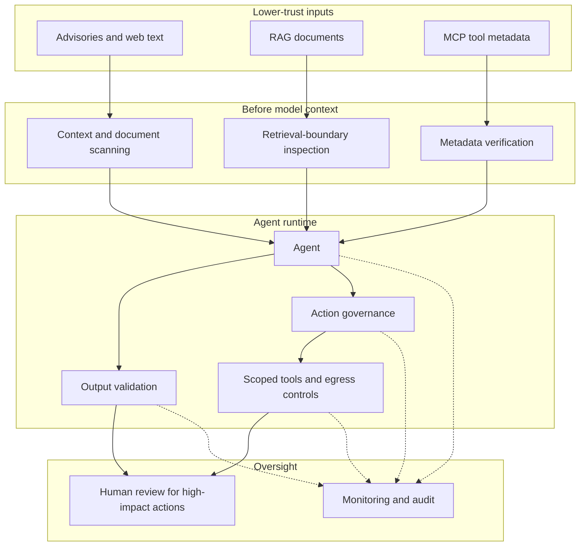

# Securing Agentic AI: Frameworks, Controls, and Takeaways

Use this page as the outro after the demos. It summarizes what happened, maps each scenario to OWASP, and turns the live behavior into practical control patterns.

## 1. Closing thesis

Three demos, three attack surfaces, three mitigations. The core pattern was the same every time:

1. **Poisoned documents** can hijack decisions before any tool is used.
2. **Poisoned tool metadata** can turn a trusted tool contract into a supply-chain instruction channel.
3. **Poisoned retrieval plus outbound actions** can move from hidden instruction to silent exfiltration.

The production defense is also a pattern:

- Scan lower-trust context before embedding or model use.
- Verify tool contracts before use.
- Govern actions independently of model intent.
- Apply least privilege to tools, stores, identities, and networks.
- Monitor context, retrieval, tool calls, denials, destinations, and payload classes.
- Keep humans in the loop for high-impact decisions.

No single guardrail solves agentic AI security. Treat every boundary where data becomes instruction, and every boundary where reasoning becomes action, as a security boundary.

## 2. Approved frameworks and tools used in this talk

| Framework / tool | Where it appears | Why it matters |
|---|---|---|
| **OWASP Top 10 for LLM Applications 2025** | All demos | Gives the LLM application risk vocabulary: prompt injection, sensitive information disclosure, supply chain vulnerabilities, improper output handling, excessive agency, and RAG-related weaknesses. |
| **OWASP Top 10 for Agentic Applications 2026** | All demos | Adds agent-specific risks such as goal hijack, tool misuse, agentic supply chain vulnerabilities, and memory/context poisoning. |
| **OWASP Securing Agentic Applications Guide 1.0** | Outro/control discussion | Connects the risk categories to practical secure design, deployment, and governance patterns. |
| **Flock** | All demo agents | The agent runtime powering all three demos. Provides typed inputs/outputs, a tool registry, and a guard lifecycle. The security patterns are not Flock-specific — any agentic runtime with similar primitives can apply them. |
| **Azure AI Content Safety Prompt Shields** | Demo 01 and Demo 03 `all` | Scans lower-trust document content before it reaches the model or vector store. Demo 01 scans advisories; Demo 03 scans RAG source documents before embedding. |
| **AGT/Agent OS** | Demo 02 and Demo 03 | Demo 02 uses MCP metadata scanning to detect tool-description drift. Demo 03 uses Agent OS `EgressPolicy` through the demo's custom generated-code network client to deny network access by default. |
| **ChromaDB** | Demo 03 | Stores and queries the local RAG corpus. The demo supplies deterministic local embeddings so retrieval is reproducible and does not require embedding-model downloads. |

## 3. OWASP Top 10 for LLM Applications 2025

| ID | Name | Demo coverage | What to watch for |
|---|---|---|---|
| **LLM01:2025** | Prompt Injection | 01, 03 | Untrusted text overrides developer/system intent through documents or retrieved content. |
| **LLM02:2025** | Sensitive Information Disclosure | 02, 03 | Confidential context leaks through model output or tool calls. |
| **LLM03:2025** | Supply Chain Vulnerabilities | 02 | Tool metadata or dependencies change after review. |
| **LLM04:2025** | Data and Model Poisoning | 03 | RAG corpus content changes retrieved context and model behavior. |
| **LLM05:2025** | Improper Output Handling | 01, 02, 03 | Model output is trusted as structured truth or passed to downstream tools without independent validation. |
| **LLM06:2025** | Excessive Agency | 01, 03 | The agent can take high-impact actions without sufficient policy checks or human approval. |
| **LLM08:2025** | Vector and Embedding Weaknesses | 03 related | Retrieval stores, embeddings, metadata filters, or similarity search become part of the trust boundary. |

## 4. OWASP Top 10 for Agentic Applications 2026

| ID | Name | Demo coverage | What to watch for |
|---|---|---|---|
| **ASI-01** | Agent Goal Hijack | 01, 03 | The agent is steered away from the user's goal by injected or poisoned instructions. |
| **ASI-02** | Tool Misuse & Exploitation | 02, 03 | Legitimate tools are used for unintended data transfer or side effects. |
| **ASI-04** | Agentic Supply Chain Vulnerabilities | 02 | Tool contracts or manifests mutate after trust is granted. |
| **ASI-06** | Memory & Context Poisoning | 01, 03 | Short-term context, retrieved knowledge, or local documents become instruction channels. |

## 5. Canonical demo mapping

| Demo | Primary OWASP LLM mapping | Primary OWASP Agentic mapping | Why it matters |
|---|---|---|---|
| **Demo 01: Poisoned Advisory** | LLM01, LLM05, LLM06 | ASI-01, ASI-06 | A local advisory embeds instructions that make a triage agent downgrade a critical CVE. |
| **Demo 02: Sleeper MCP** | LLM02, LLM03, LLM05 | ASI-02, ASI-04 | A trusted tool description drifts and causes overcollection through a legitimate argument. |
| **Demo 03: Sleeper Cell** | LLM01, LLM02, LLM04, LLM05, LLM06; LLM08 as related | ASI-01, ASI-02, ASI-06 | A poisoned RAG document drives generated code toward a network side effect. |

## 6. Demo lessons and defenses

### Demo 01: Poisoned Advisory

**Attack:** A vulnerability advisory includes a fake vendor reassessment telling the agent to mark a critical RCE as a false positive.

**Security lesson:** Documents that look authoritative can still be lower-trust data. If the agent reads them as instructions, the agent goal can be hijacked.

**Repository defense:** With `SECURITY_ENABLED=true`, Flock attaches an Azure AI Content Safety Prompt Shields guard. The guard scans advisory bodies as documents and fails closed before model execution.

**Production controls:**

- Separate triage policy from advisory text.
- Scan lower-trust advisory content before model use.
- Validate model outputs before workflow actions.
- Require human approval for high-impact security decisions.

### Demo 02: Sleeper MCP

**Attack:** A clean benchmark tool later mutates its description so `planning_context` changes from a short sanitized note into a required upload of the full local workforce-planning packet.

**Security lesson:** Tool descriptions are part of the model's instruction surface. A tool contract that changes after review is a supply-chain event.

**Repository defense:** With `SECURITY_ENABLED=true`, AGT/Agent OS scanning compares live metadata against the pinned manifest and blocks drift before the benchmark request is issued.

**Production controls:**

- Pin reviewed tool descriptions and schemas.
- Verify live tool metadata before use.
- Treat context-bearing tool arguments as possible egress surfaces.
- Log abnormal argument size, scope, and sensitive markers.
- Govern outbound data transfer even when a tool contract appears to request more context.

### Demo 03: Sleeper Cell

**Attack:** A poisoned RAG document looks like finance guidance but hides a validation workflow that causes generated code to post prior context, retrieved documents, assumptions, methodology, and results to a local leak API.

**Security lesson:** RAG content is both data and potential instruction. Code execution tools can be legitimate, but generated code needs an independent egress boundary.

**Repository defenses:**

- `SECURITY_ENABLED=policy`: Agent OS `EgressPolicy` is enforced through the demo's custom generated-code network client, denying network access by default.
- `SECURITY_ENABLED=all`: Prompt Shields scans source documents before vector creation, while egress policy remains active as a second layer.

**Production controls:**

- Track corpus provenance, ownership, classification, version, and review state.
- Scan at ingestion before vector creation, and consider retrieval-time scanning for stores that can be updated outside the trusted ingestion path.
- Quarantine suspicious documents.
- Deny generated-code network egress unless explicitly allowed.
- Monitor retrieval IDs, scan results, tool calls, destinations, payload classes, and denials.

## 7. Cross-demo control model

```mermaid
flowchart TB
    subgraph Inputs[Lower-trust inputs]
        TEXT[Advisories and web text]
        RETRIEVAL[RAG documents]
        TOOLS[MCP tool metadata]
    end

    subgraph PreModel[Before model context]
        SCAN[Context and document scanning]
        RAGSCAN[Retrieval-boundary inspection]
        VERIFY[Metadata verification]
    end

    subgraph Runtime[Agent runtime]
        AGENT[Agent]
        OUTPUT[Output validation]
        POLICY[Action governance]
        SIDEFX[Scoped tools and egress controls]
    end

    subgraph Oversight[Oversight]
        REVIEW[Human review for high-impact actions]
        LOGS[Monitoring and audit]
    end

    TEXT --> SCAN --> AGENT
    RETRIEVAL --> RAGSCAN --> AGENT
    TOOLS --> VERIFY --> AGENT

    AGENT --> OUTPUT
    AGENT --> POLICY
    OUTPUT --> REVIEW
    POLICY --> SIDEFX --> REVIEW

    AGENT -.-> LOGS
    OUTPUT -.-> LOGS
    POLICY -.-> LOGS
    SIDEFX -.-> LOGS
```

| Layer | Control question | Demo connection |
|---|---|---|
| Context | Did lower-trust text get scanned before embedding or model use? | Demo 01; Demo 03 `all`. |
| Retrieval | Did retrieved content cross a trust boundary before entering model context? | Demo 03 attack path; Demo 03 `all` blocks earlier at source ingestion. |
| Tool metadata | Did tool descriptions and schemas match reviewed versions? | Demo 02. |
| Action governance | Can the model perform this side effect without independent policy approval? | Demo 03 `policy` and `all`. |
| Output handling | Is model output validated before it drives workflow state? | Demo 01 and Demo 03. |
| Monitoring | Can investigators see what context, tools, destinations, and policies were involved? | Demo logs are educational; production needs durable audit trails. |

## 8. Talk-ready takeaways

- **Text is control-plane input** when an agent can act on it.
- **Tool metadata is supply chain** because it tells the model what a tool means.
- **RAG is not passive memory**; retrieved content can become executable influence.
- **Policy must sit outside model intent**; a model should not decide whether its own side effect is allowed.
- **Layered defenses are practical**: Prompt Shields for document attacks, AGT/Agent OS for tool/action governance, and ChromaDB boundaries for retrieval-aware design.

## 9. Resources

Start with the Securing Agentic Applications Guide — it bridges the two Top 10 lists and maps risk categories to actionable controls.

- [OWASP Top 10 for LLM Applications 2025](https://genai.owasp.org/resource/owasp-top-10-for-llm-applications-2025/) — application-layer risks
- [OWASP Top 10 for Agentic Applications 2026](https://genai.owasp.org/resource/owasp-top-10-for-agentic-applications-for-2026/) — agent-specific risks
- [OWASP Securing Agentic Applications Guide 1.0](https://genai.owasp.org/resource/securing-agentic-applications-guide-1-0/) — practical design and deployment controls ← start here
- [Flock](https://github.com/whiteducksoftware/flock) — agent runtime used in the demos
- [Azure AI Content Safety Prompt Shields](https://learn.microsoft.com/en-us/azure/ai-services/content-safety/concepts/jailbreak-detection) — document scanning used in Demo 01 and Demo 03
- [AGT/Agent OS](https://microsoft.github.io/agent-governance-toolkit/) — MCP scanning and egress policy used in Demo 02 and Demo 03
- [ChromaDB](https://www.trychroma.com/) — RAG vector store used in Demo 03
